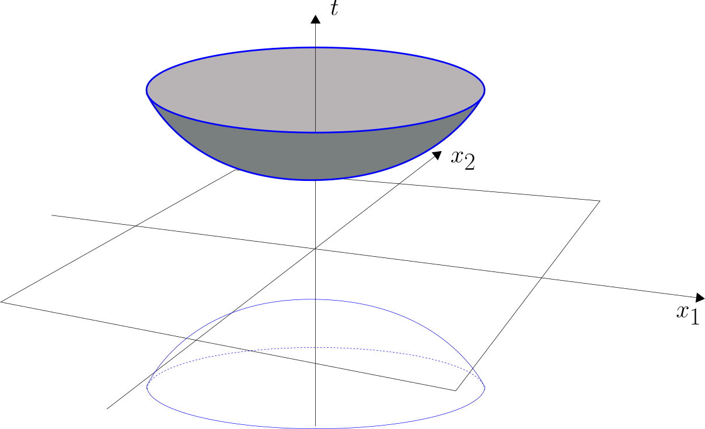
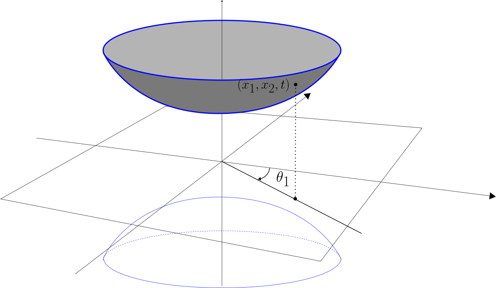
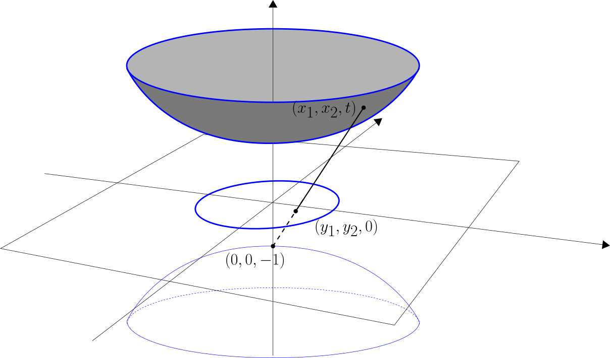

Hyperbolic Geometry
===================

Hyperbolic geometry provides a natural continuous framework for representing hierarchical and tree-like structures. 
In contrast to Euclidean geometry, hyperbolic space exhibits exponential volume growth with respect to radius, allowing distances to naturally reflect hierarchical depth and branching factors. 
As a consequence, negatively curved spaces admit low-distortion embeddings of trees and tree-like graphs that necessarily incur large distortion in Euclidean geometry.

We consider the :math:`n`-dimensional hyperbolic space :math:`\mathbb{H}^n`, a complete, simply connected Riemannian manifold of constant negative curvature. 
Although :math:`\mathbb{H}^n` is unique up to isometry, it admits several equivalent coordinate representations (or *models*), each highlighting different geometric or analytic properties. 
We briefly review the most common models used in Graph Representation Learning and their relevance for theoretical analysis and algorithmic constructions.

Lorentz (hyperboloid) model
-----------------------------

We primarily adopt the Lorentz, or hyperboloid, model of hyperbolic space. Let :math:`\mathbb{R}^{n+1}` be endowed with the Minkowski bilinear form

.. math::
   \langle \mathbf{u}, \mathbf{v} \rangle
   =
   \sum_{i=1}^n u_i v_i - u_{n+1} v_{n+1}.

The :math:`n`-dimensional hyperbolic space :math:`\mathbb{H}^n` is then realized as

.. math::

   \mathbb{H}^n
   =
   \left\{
   \mathbf{u} \in 
   \mathbb{R}^{n+1} :
   \langle \mathbf{u}, \mathbf{u} \rangle = -1,\;
   u_{n+1}>0
   \right\},

with geodesic distance given by

.. math::
   d_H(\mathbf{u}, \mathbf{v}) = \operatorname{arcosh}\bigl(-\langle \mathbf{u}, \mathbf{v} \rangle\bigr).

It is common to write :math:`\mathbf{u}=(\mathbf{x},t)`, where the last coordinate plays the role of a time-like component, satisfying :math:`\|\mathbf{x}\|^2 - t^2 = -1` with :math:`t>0`. Geometrically, :math:`\mathbb{H}^n` corresponds to the upper sheet of a two-sheeted hyperboloid in :math:`\mathbb{R}^{n+1}`, and its geodesics are given by the intersections of the hyperboloid with Euclidean planes passing through the origin.

   The hyperboloid model. Only the upper sheet (i.e.\ :math:`t>0`) is considered.

The Lorentz model admits simple closed-form expressions for distances and gradients and provides a convenient global parametrization of hyperbolic space, making it particularly well suited for both theoretical analysis and optimization. This motivates its use as the default representation in ``HypeGRL``. Moreover, several alternative representations of hyperbolic space can be naturally interpreted in terms of the Lorentz model.

Spherical (or native) representation
------------------------------------
The spherical representation of hyperbolic space is the polar parametrization in terms of a radial coordinate :math:`r` (hyperbolic distance to the point at :math:`\mathbf{x}=\mathbf{0}` and :math:`t=1`) and angular coordinates :math:`\theta=(\theta_1,\theta_2,\ldots,\theta_{n-1})`.

   Spherical representation of hyperbolic space for :math:`n=2`.

This means that for :math:`n=2` the distance between two points is

.. math::

   d(\mathbf{u}, \mathbf{v})
   =
   \operatorname{arcosh}\!\left(
   \cosh r_u \cosh r_v
   -
   \sinh r_u \sinh r_v \cos(\theta_{u,v})
   \right).

with :math:`\theta_{u,v}` being the angular separation between :math:`\mathbf{u}` and :math:`\mathbf{v}`. For large radii, this distance admits the asymptotic approximation

.. math::

   d(\mathbf{u}, \mathbf{v})
   \approx
   r_u + r_v + 2\log(\theta_{u,v}/2),
   
which makes explicit the separation between radial growth, capturing hierarchical depth, and angular separation, capturing similarity. This decomposition underlies random hyperbolic graph models and the embedding methods built upon them.

Poincaré ball model
-------------------
The Poincaré (or Poincaré-Beltrami) ball model is obtained by stereographically projecting the hyperboloid onto the plane :math:`t=0`, using the south pole (located at :math:`\mathbf{x}=\mathbf{0}` and :math:`t=-1`) as the center of projection. This construction yields a representation of :math:`\mathbb{H}^n` as the unit ball

.. math::

   \mathbb{B}^{n} = \{\mathbf{y}\in \mathbb{R}^n : \|\mathbf{y}\|<1\},

with the mapping from Lorentz coordinates :math:`(\mathbf{x},t)` given by :math:`\mathbf{y} = \frac{\mathbf{x}}{1+t}`.

   Transforming between hyperboloid and Poincaré models.
   
The Poincaré model is conformal, meaning that angles are preserved, and geodesics appear as circular arcs orthogonal to the boundary of the unit ball. The distance between two points in this model is

.. math::
    d_P (\mathbf{y}_1,\mathbf{y}_2) =  \operatorname{arcosh}\!\left(1+\frac{2\|\mathbf{y}_1-\mathbf{y}_2\|^2}{(1-\|\mathbf{y}_1\|^2)(1-\|\mathbf{y}_2\|^2)}\right). 

Although distances become increasingly distorted near the boundary, this representation is particularly useful for geometric intuition and visualization.
